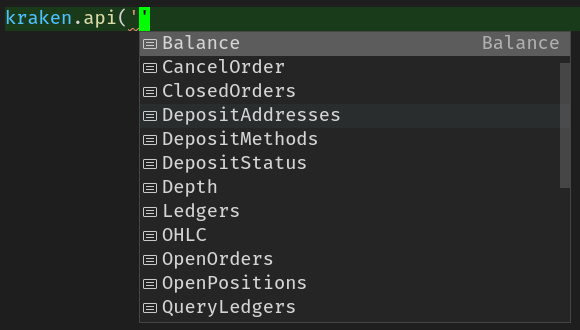

# kraken-api-browser

`kraken-api-browser` is a browser port of the server-side kraken API [`kraken-api`](https://github.com/nothingisdead/npm-kraken-api).

Use `npm i kraken-api-browser` to install it.

It's a es6 module file, which means you can directly import it into your web page

```html
<script type="module" src="/node_modules/kraken-api-browser/build.js"></script>
```
*(see Browser Usage for more details)*  


You can also import it in a es6 module project, and in a TypeScript project (typings included)

```typescript
import { KrakenClient } from 'kraken-api-browser';
```

## Usage

```javascript
const kraken = new KrakenClient();

async function main () {
  const { result } = await kraken.api('Ticker', { pair: 'XBTEUR' });

  console.log(result);
}

main()
```

### Browser Usage

```html
<script src="/node_modules/kraken-api-browser/build.js" type="module"></script>
<script>
  const kraken = new KrakenClient();
  ...
</script>
```

or

```html
<script type="module">
  import { KrakenClient } from '/node_modules/kraken-api-browser/build.js';

  const kraken = new KrakenClient();
  ...
</script>
```

*(note: if you are using a server that resolves es module paths on requests you know what's up)*

### TypeScript Usage

If you are using TypeScript you can easily see the methods available with auto-suggestion feature in your IDE.




## Availabe public methods

```
'Time' | 'Assets' | 'AssetPairs' | 'Ticker' | 'Depth' | 'Trades' | 'Spread' | 'OHLC'
```
*(note: You can also use the `publicMethod` function to narrow down the list of available public methods because right now the private methods won't work, read the disclaimer below)*


# Disclaimer

I contacted the Kraken support to ask them to allow cors requests when using private methods such as `Balance` but they couldn't help me... When requesting a private method Kraken API requires a bunch of security codes such as the API keys and other things to be sent in the header of that https request. On a server side it works just fine but browsers such as Google Chrome send a pre-flight `OPTIONS` request before the `POST` one (https://stackoverflow.com/a/29954326/773595) when modifying the header of sensitive requests.
**For this reason the private methods in this framework are for the time being not working**
One way for Kraken to fix this issue would be to accept `OPTIONS` requests from trusted origins (if not all origins) but they didn't.


## Support

[Buy Me a Coffee](https://www.buymeacoffee.com/vdegenne)
bitcoin address: 3KfrLBhWgKxnNH9hoC8ipSPYi3LW3Qrj8i